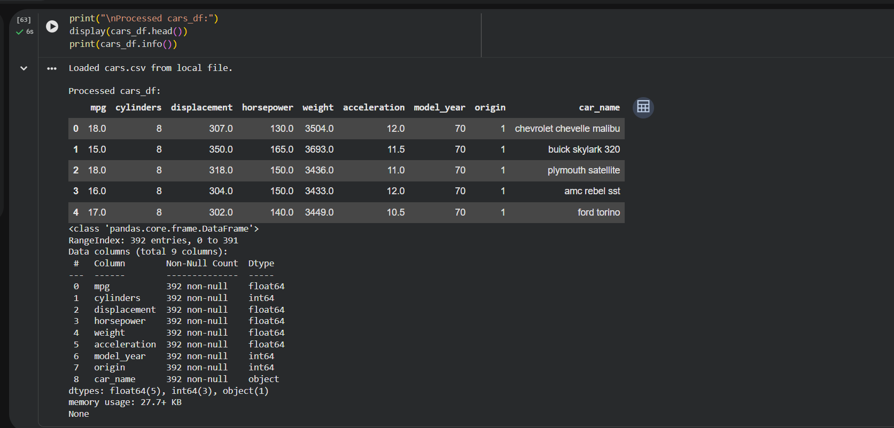

# 🚗 AI Data Pipeline & Car Price Prediction App

An end-to-end AI-powered data analysis and machine learning project built using Python, Pandas, Scikit-learn, and Streamlit.

## 📌 Project Overview

This project demonstrates a complete AI data pipeline workflow including:

* Data collection and preprocessing
* Exploratory Data Analysis (EDA)
* Feature engineering
* Machine Learning model training
* Model evaluation
* Deployment using Streamlit

This application predicts car prices based on user inputs through an interactive web interface.

---

## 🎯 Problem Statement
Predict car prices using machine learning based on features like horsepower, weight, and other specifications.

---

## 🚀 Live Demo

🔗 Streamlit App:
🔗 Live Demo: https://ai-data-pipelines-9svaxxq3wgupmftmiawegf.streamlit.app/
---

## 📂 Project Structure

```bash
├── AI Data Pipeline.ipynb
├── app.py
├── model.pkl
├── requirements.txt
├── cars.csv
├── output.png
└── README.md
```

---

## 🛠️ Technologies Used

* Python
* Pandas
* NumPy
* Scikit-learn
* Streamlit
* Joblib
* Matplotlib

---

## ⚙️ Features

✅ Data preprocessing pipeline
✅ Machine learning prediction system
✅ Interactive Streamlit UI
✅ Model deployment support
✅ Real-time predictions

---

## 📊 Machine Learning Workflow

1. Data Cleaning
2. Data Analysis
3. Feature Selection
4. Model Training
5. Model Saving using Joblib
6. Web App Creation
7. Deployment using Streamlit Cloud

---

## ▶️ Run Locally

Clone the repository:

```bash
git clone https://github.com/tarunibabu2006-tech/ai-data-pipelines-9svaxxq3wgupmftmiawegf.git
```

Install dependencies:

```bash
pip install -r requirements.txt
```

Run the application:

```bash
streamlit run app.py
```

---

## 📸 Output Screenshot



---

## 🌐 Deployment

This project is deployed using:

* GitHub
* Streamlit Community Cloud

---

## 👨‍💻 Author

Tarunika Babu

GitHub: https://github.com/tarunibabu2006-tech

---

## ⭐ Future Improvements

* Advanced UI design
* API integration
* Docker deployment
* Cloud database integration
* Real-time analytics dashboard
